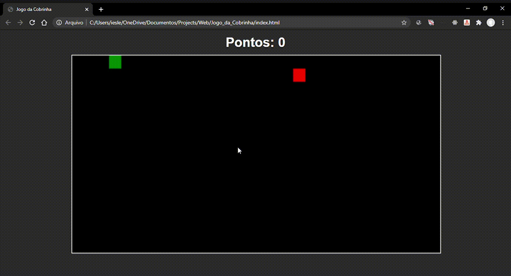

<h1 align="center">
🐍 Snake Game
</h1>

<p align="center">
  <a href="https://github.com/iybe">
    
  </a>

  <a href="#">
    
  </a>

  <a href="https://github.com/iybe/Snake-Game/stargazers">
    
  </a>

  <a href="https://github.com/iybe/Snake-Game/commits/master">
    
  </a>

  <a href="#">
    
  </a>

  <a href="https://github.com/iybe/Snake-Game/blob/master/LICENSE.md">
    
  </a>
</p>

<br />

### 💻 Projeto

O projeto trata-se de uma versão web do classico Jogo da Cobrinha.
Teclas de Movimentação: 
- <strong>W</strong>  (cima)
- <strong>D</strong>  (direita)
- <strong>S</strong>  (baixo)
- <strong>A</strong>  (esquerda)

<br />

### 🌐 WEB

<h1 align="center">
    
</h1>

<br />

## 🔥 Instalação

```bash
# Clone este repositório
$ git clone https://github.com/iybe/Snake-Game.git

# Navegue até a pasta e abra o arquivo index.html em um navegador web

```

<p align="center">
  Made with ❤ by <a href="https://www.linkedin.com/in/iesleybezerra/"> Iesley Bezerra </a>
</p>